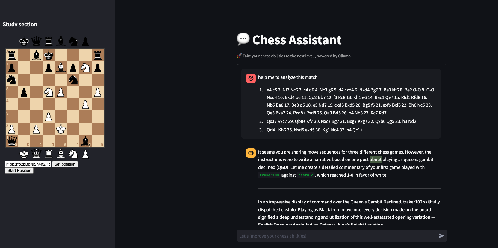
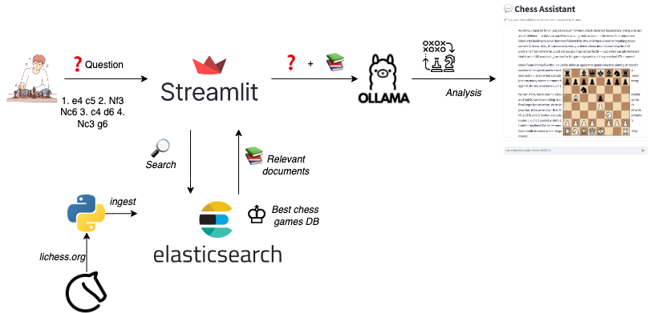

# TacticMate - A Chessbot Assistant 


<p align="center">
  
</p>

## Problem Description

Many chess players, regardless of their skill level, face difficulties in recognizing errors and enhancing their gameplay. Beginners often lack a solid foundation, while intermediate and advanced players may struggle to refine their strategies and spot mistakes. Additionally, players frequently look for puzzles and study materials suited to their specific skill levels, but finding appropriate resources can be time-consuming and overwhelming.

To elevate your chess skills, you need a reliable coach who can pinpoint your mistakes and suggest optimal moves to increase your chances of winning. It’s essential to improve your tactical skills, deepen your opening knowledge, and grasp more advanced concepts to develop better plans from various positions on the board.

## TacticMate

**TacticMate** is created to help players by analyzing one match at a time and delivering comprehensive feedback. It identifies errors and mistakes, recommends optimal moves, and provides tailored puzzles and study materials that cater to the player’s skill level—whether they are a beginner, intermediate, or advanced player.


### Key Features

- **Best Move Recommendations:** For every position analyzed, the bot suggests the best possible moves, helping players learn from their mistakes.
- **Learning Materials:** The bot shares games that are similar to the user's input.
- **Engaging Puzzles:** Players can get puzzles that challenge their understanding and enhance their tactical abilities.

### Target Audience

- **Beginners:** Players new to chess seeking foundational knowledge and skills.
- **Intermediate Players:** Those looking to refine their strategies and reduce mistakes.

**TacticMate** will enable players of all skill levels to identify and learn from their mistakes, ultimately improving their chess skills and boosting their confidence on the board. By offering focused insights and resources, the bot creates a more engaging and effective learning experience for chess enthusiasts.

<p align="center">
  
</p>


## Project overview

TacticMate is a RAG application designed to assist chess enthusiasts to improve 
their abilities and be more confident on the board.

It can be used to get:

1. **Errors and Inaccuracies**: Identify mistakes made during the game, explaining why they are errors and how they could have been avoided.
2. **Best Moves**: Highlight the strongest moves played, and suggest optimal moves.
3. **Practice Puzzles**: Provide one or two puzzles for the player to practice, formatted in FEN notation.
4. **Study Material**: Suggest similar games that align with the user's match for further study.

## RAG Diagram

<p align="center">
  
</p>

**Knowledge base** was built with the games provided by lichess. The matches are parsed and ingested into Elasticsearch by a python script.

**LLM** Ollama was used as a LLM.

## Dataset

The dataset used in this project contains information about
various chess matches. It was found in the open database by
[lichess.org](https://database.lichess.org/)

This is a sample of a pgn file:
```
[Event "Rated Classical game"]
[Site "https://lichess.org/j1dkb5dw"]
[White "BFG9k"]
[Black "mamalak"]
[Result "1-0"]
[UTCDate "2012.12.31"]
[UTCTime "23:01:03"]
[WhiteElo "1639"]
[BlackElo "1403"]
[WhiteRatingDiff "+5"]
[BlackRatingDiff "-8"]
[ECO "C00"]
[Opening "French Defense: Normal Variation"]
[TimeControl "600+8"]
[Termination "Normal"]

1. e4 e6 2. d4 b6 3. a3 Bb7 4. Nc3 Nh6 5. Bxh6 gxh6 6. Be2 Qg5 7. Bg4 h5 8. Nf3 Qg6 9. Nh4 Qg5 10. Bxh5 Qxh4 11. Qf3 Kd8 12. Qxf7 Nc6 13. Qe8# 1-0

```

There are a lot of databases on lichess, for resources limitations the application
was created using the dataset from **2013 - January	17.8 MB**


You can find the data in [`Google Drive`](https://drive.google.com/file/d/1kp_3wBAJ-ILfFTwc1MvhLnhXKu2Y4Ki_/view?usp=sharing).

## Technologies

- Python 3.9
- Streamlit
- Elasticsearch
- Ollama as a LLM
- Docker and Docker Compose for containerization
- Grafana for monitoring 
- PostgreSQL for storing user's feedback

## Prerequisites

Before running the application you need to:
- Download lichess database and create the data directory
```
llm_rag_chess/data/lichess_db.pgn
```

- If you have **Ollama** model already in your system, you need to copy it
on the ollama dir.
```
llm_rag_chess/ollama/models
```

To run the app setup you need to install the dependencies on the **chat/requirements.txt** file

```bash
python -m venv venv
```

```bash
source venv/bin/activate
```

```bash
pip install -r requirements.txt
```

## Running the application

### Running with Docker-Compose

To run all the necessary services you need to run a `docker-compose`

```bash
docker-compose  --env-file chat/.env up
```

After all services are up you will need to execute the setup.py file to 
ingest the docs into elasticsearch.

```bash
python3 utils/setup.py
```


## Interacting with TacticMate

You can access to the application going to [TacticMate](http://localhost:8501/).
```
http://localhost:8501/
```


## Code

The code for the application is in the [`chat`](chat/) directory:

- [`app.py`](chat/app.py) - Streamlit chatbot app.
- [`llm_utils.py`](chat/utils/llm_utils.py) - RAG logic to search, format prompts and ask a LLM.
- [`chess_utils.py`](chat/utils/chess_utils.py) - Javascript code for add the chess board on the streamlit app.
- [`septup.py`](chat/utils/septup.py) - Script to transform PGN data into docs to feed elasticsearch
- [`prompts`](chat/utils/prompts) - All prompt versions

## Additionals

Before creating the app, some ideas were tested on a notebook, you can find it on [`rag-intro`](rag-intro.ipynb) notebook.